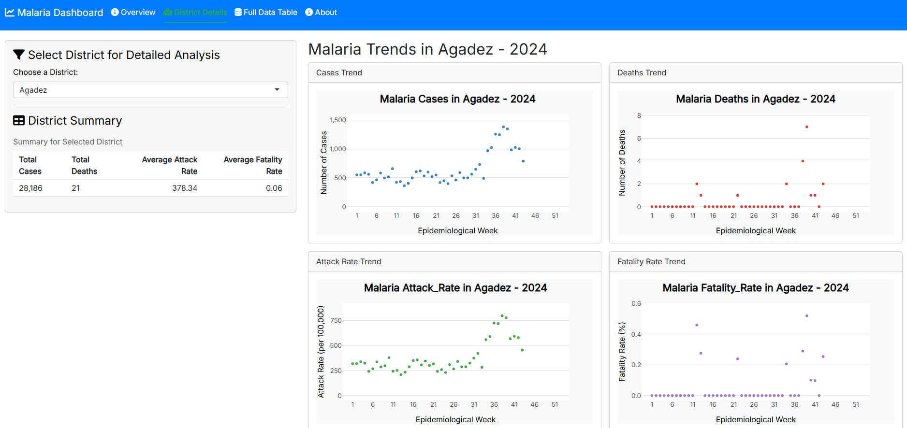

# Malaria Data Dashboard for Niger

## Overview
This repository contains a **Shiny application** built in R to analyze and visualize malaria data in Niger from 2019 to 2024. The application provides interactive dashboards, maps, forecasting, anomaly detection, and AI-powered recommendations to support public health decision-making. It leverages data from the Niger Ministry of Health's MDO reports and integrates geographic data for regional visualizations.

Key features include:
- **Interactive Visualizations**: Time-series plots, static and interactive maps, and bar charts to explore malaria metrics (e.g., Confirmed Cases, Attack Rate, Fatality Rate).
- **Data Explorer**: An interactive table for detailed data exploration with filtering and sorting capabilities.
- **Forecasting**: Predicts malaria trends up to 12 weeks using the Prophet library.
- **Outbreak Alerts**: Detects anomalies in malaria metrics using the anomalize package.
- **AI-Powered Recommendations**: Identifies high-risk regions based on Attack Rate, Positive Rate, Fatality Rate, and recent case trends, with actionable intervention suggestions.
- **Natural Language Queries**: Allows users to ask questions about the data via an xAI API (requires an API key).
- **Data Export**: Download filtered data in CSV or Excel formats.

## 📸 Dashboard Preview

 


 
*Note: This is a placeholder image. To include your own screenshot, follow the instructions below:*
- **Take a Screenshot**: Run the app (`app.R`), navigate to the desired tab (e.g., Overview or District Details), and capture a screenshot.
- **Upload the Image**: Save the screenshot (e.g., as `screenshots/dashboard.png`) and upload it to a `screenshots` folder in your repository:
  ```bash
  mkdir screenshots
  git add screenshots/dashboard.png
  git commit -m "Add dashboard screenshot"
  git push origin main
  ```
- **Update the Link**: Replace the placeholder URL above with:
  ```markdown
  
  ```
This will display your custom image, showcasing the dashboard’s interface.

## Data Sources
The application uses the following datasets:
- **Malaria Data**:
  - `MDO_Niger Semaine 52 2019.xlsx`
  - `MDO_Niger Semaine 53 2020.xls`
  - `MDO_Niger Semaine 52 2021.xlsx`
  - `MDO_NIGER 2022 S52.xlsx`
  - `MDO 2023 S52.xls`
  - `MDO 2024 S43.xls`
- **Geographic Data**: Niger administrative level 1 boundaries from [Humanitarian Data Exchange (HDX)](https://data.humdata.org/dataset/niger-admin-level-1-boundaries) (`NER_admbnda_adm1_IGNN_20230720.shp`).

## Prerequisites
To run the application locally, ensure you have the following:
- **R**: Version 4.0.0 or higher.
- **RStudio**: Recommended for running Shiny applications.
- **Dependencies**: Install the required R packages listed below.
- **Data Files**: Place the malaria data Excel files in the root directory and the shapefile in a `data/shp/` subdirectory relative to `app.R`.
- **xAI API Key** (optional): Required for the "Ask AI" feature. Set it as an environment variable (`XAI_API_KEY`).

### Required R Packages
```R
install.packages(c(
  "tidyverse", "readxl", "readr", "janitor", "writexl",
  "shiny", "shinydashboard", "shinythemes", "plotly",
  "DT", "shinyjs", "sf", "leaflet", "ggplot2",
  "RColorBrewer", "prophet", "anomalize", "httr",
  "jsonlite", "cluster", "lubridate"
))
```

## Installation
1. **Clone the Repository**:
   ```bash
   git clone https://github.com/your-username/malaria-data-dashboard.git
   cd malaria-data-dashboard
   ```

2. **Place Data Files**:
   - Copy the malaria data Excel files (listed above) into the root directory of the repository.
   - Ensure the shapefile (`NER_admbnda_adm1_IGNN_20230720.shp`) is in the `data/shp/` directory.

3. **Set Up Environment**:
   - Install R and RStudio if not already installed.
   - Install the required R packages (see above).
   - (Optional) For the "Ask AI" feature, set your xAI API key:
     ```R
     Sys.setenv(XAI_API_KEY = "your-api-key-here")
     ```
     You can obtain an API key from [xAI](https://x.ai/api).

4. **Run the Application**:
   - Open `app.R` in RStudio.
   - Click the "Run App" button, or run the following in the R console:
     ```R
     library(shiny)
     shiny::runApp("app.R")
     ```

## Usage
1. **Launch the App**:
   - The application opens in a browser window with a dashboard interface branded with the UNICEF logo.
   - A welcome notification provides options to view the "How-to Guide" or dismiss it.

2. **Navigate Tabs**:
   - **Dashboard Overview**: View time-series plots, static and interactive maps, bar charts, and region clustering.
   - **Data Explorer**: Explore the full dataset in an interactive table with search and filter options.
   - **Forecast**: See 12-week predictions for selected malaria metrics.
   - **Outbreak Alerts**: Identify unusual spikes in metrics indicating potential outbreaks.
   - **Ask AI**: Query the data in natural language (requires xAI API key).
   - **Recommendations**: View prioritized regions for intervention with actionable suggestions based on multiple metrics.
   - **How-to Guide**: Detailed instructions on using the dashboard.
   - **Information**: Background on the dashboard, methodology, and data sources.

3. **Apply Filters**:
   - Use the sidebar to filter by **Year**, **Week**, **Region**, and **Metric** (e.g., Confirmed Cases, Attack Rate).
   - Filters dynamically update visualizations and the data table.

4. **Export Data**:
   - Download filtered data as CSV or Excel files using the sidebar buttons.

## Application Structure
- **app.R**: The main Shiny application file containing both UI and server logic.
- **data/shp/**: Directory for the Niger shapefile (`NER_admbnda_adm1_IGNN_20230720.shp`).
- **Malaria Data Files**: Excel files in the root directory, processed to generate combined indicators.

## Methodology
- **Data Processing**: Excel files are cleaned and reshaped using `tidyverse` and `readxl`. Region names are standardized to match the shapefile.
- **Metrics**:
  - Suspected Cases, Confirmed Cases, Confirmed Deaths.
  - Positive Rate (%): (Confirmed Cases / Suspected Cases) * 100.
  - Attack Rate (per 100,000): (Confirmed Cases / Population) * 100,000.
  - Fatality Rate (%): (Confirmed Deaths / Confirmed Cases) * 100.
- **Forecasting**: Uses the Prophet library for time-series predictions with yearly and weekly seasonality.
- **Anomaly Detection**: Employs the anomalize package with STL decomposition and IQR method to detect outliers.
- **Clustering**: Applies k-means clustering to group regions by similar metric patterns.
- **Recommendations**: Combines Attack Rate, Positive Rate, Fatality Rate, and recent case trends into a weighted priority score to identify high-risk regions and suggest interventions.

## Recommendations
The "Recommendations" tab prioritizes regions for intervention based on:
- **Attack Rate**: Incidence of confirmed cases per 100,000 population.
- **Positive Rate**: Proportion of suspected cases confirmed.
- **Fatality Rate**: Proportion of confirmed cases resulting in death.
- **Case Trend**: Percentage change in confirmed cases over the last 4 weeks.
Regions are assigned a priority score (0–1) and classified as High (≥0.7) or Moderate (≥0.4) risk, with tailored interventions (e.g., mosquito net distribution, enhanced testing).

## Notes
- Ensure the shapefile and Excel files are in the correct directories, as the application expects specific paths.
- The "Ask AI" feature requires a valid xAI API key. Without it, the feature will return an error.
- Some data files may have inconsistencies (e.g., missing weeks or regions). The application handles these gracefully and displays warnings for data loading issues.
- The application is optimized for desktop browsers. Mobile responsiveness may be limited.

## Contributing
Contributions are welcome! Please:
1. Fork the repository.
2. Create a new branch (`git checkout -b feature/your-feature`).
3. Commit your changes (`git commit -m "Add your feature"`).
4. Push to the branch (`git push origin feature/your-feature`).
5. Open a pull request.

## License
This project is licensed under the MIT License. See the [LICENSE](LICENSE) file for details.

## 📞 Contact

For questions or feedback, contact Aboubacar Hema at [aboubacarhema94@gmail.com](mailto:aboubacarhema94@gmail.com).


